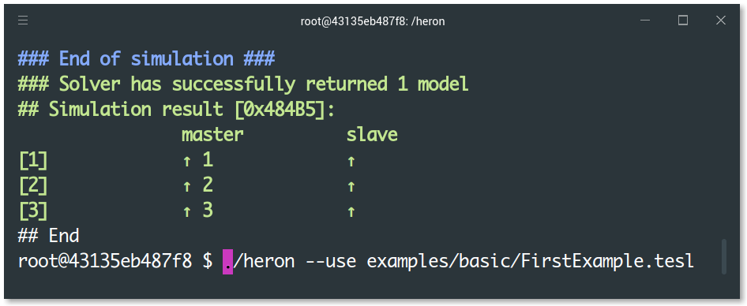

Heron [](https://travis-ci.org/heron-solver/heron) [](https://github.com/EmptyStackExn/heron/releases/latest) [](https://hub.docker.com/repository/docker/emptystackexn/heron)
===================



**Heron** [1, 2, 3, 6] is a solver for the [Tagged Events Specification Language (TESL)](http://wdi.supelec.fr/software/TESL/) [4], a declarative language for specifying synchronization of discrete events for simulation. This prototype provides:

 1. Definition of TESL specifications for causality and time scale between events.
 2. Simulation by [sound and complete](https://github.com/heron-solver/hygge) generation of execution traces.
 3. Scenario testing.


Getting started
-------------------

### Try me with Docker
The easiest way to start with Heron is to get [Docker](https://docs.docker.com/get-docker/) and then simply type
```
$ docker run -it emptystackexn/heron
# ./heron --use examples/basic/FirstExample.tesl
```

### Binary distribution
You can also fetch the [latest binary release](https://github.com/EmptyStackExn/heron/releases/latest) for your operating system (Linux and macOS).

### Examples
 - [Cessna 172 Takeoff](doc/examples/C172-Takeoff.md) [5]
 - [Airbus A320 Autobrake](doc/examples/A320-Autobrake.md) [5]
 - [Airbus A320 Accelerate-Stop](doc/examples/A320-AccelerateStop.md) [5]
 - [Proportional–integral–derivative Controller](examples/PID.tesl) [6]
 - [Timed Automaton](examples/TimedAutomatonMsgAlarm.tesl) [6]

For more information, please refer to the [Heron Reference Manual](doc/README.md).

Research
-------------------

 1. [Formalizing Time and Causality in Polychronous Polytimed Models](https://tel.archives-ouvertes.fr/tel-01892649/document) (Doctoral Thesis), Hai Nguyen Van, 2018.
 2. [On the Semantics of Polychronous Polytimed Specifications](.), Formal Modeling and Analysis of Timed Systems (FORMATS), 18th International Conference, Vienna, Austria, Sept 1-3, 2020.
 3. [A Symbolic Operational Semantics for TESL with an Application to Heterogeneous System Testing](https://hal-centralesupelec.archives-ouvertes.fr/hal-01583815v1), Formal Modeling and Analysis of Timed Systems (FORMATS), 14th International Conference, Berlin, Germany, Sept 5-7, 2017.
 4. [TESL: a Language for Reconciling Heterogeneous Execution Traces](https://tel.archives-ouvertes.fr/SUP_E3S/hal-01100179v1), Formal Methods and Models for Codesign (MEMOCODE), 2014 Twelfth ACM/IEEE International Conference on, Lausanne, Switzerland, Oct, 2014, 114-123.
 5. [Timed Discrete-Event Simulation of Aviation Scenarios](https://www.sne-journal.org/fileadmin/user_upload_sne/SNE_Issues_OA/SNE_30_2/articles/sne.30.2.10512.tn.OA.pdf), Simulation Notes Europe, Volume 30(2), June 2020.
 6. [TESL: a Model with Metric Time for Modeling and Simulation](.), Temporal Representation and Reasoning, 27th International Symposium, Bozen-Bolzano, Italy, Sept 23-25, 2020.

People
-------------------

The project is named after [Heron of Alexandria](http://www-history.mcs.st-andrews.ac.uk/Biographies/Heron.html), the first-century Greek mathematician and engineer. It uses [MPL](https://github.com/MPLLang/mpl) ([MLton](http://mlton.org)) as its Standard ML compiler. Contributions by Hai Nguyen Van, Thibaut Balabonski, Frédéric Boulanger, Chantal Keller, Benoît Valiron, Burkhart Wolff.

License
-------------------

Heron is released under the MIT License.

THE PROVIDER MAKES NO REPRESENTATIONS ABOUT THE SUITABILITY, USE, OR PERFORMANCE OF THIS SOFTWARE OR ABOUT ANY CONTENT OR INFORMATION MADE ACCESSIBLE BY THE SOFTWARE, FOR ANY PURPOSE. THE SOFTWARE IS PROVIDED "AS IS," WITHOUT EXPRESS OR IMPLIED WARRANTIES INCLUDING, BUT NOT LIMITED TO, ANY IMPLIED WARRANTIES OF MERCHANTABILITY, FITNESS FOR A PARTICULAR PURPOSE, OR NONINFRINGEMENT WITH RESPECT TO THE SOFTWARE. THE PROVIDER IS NOT OBLIGATED TO SUPPORT OR ISSUE UPDATES TO THE SOFTWARE.
